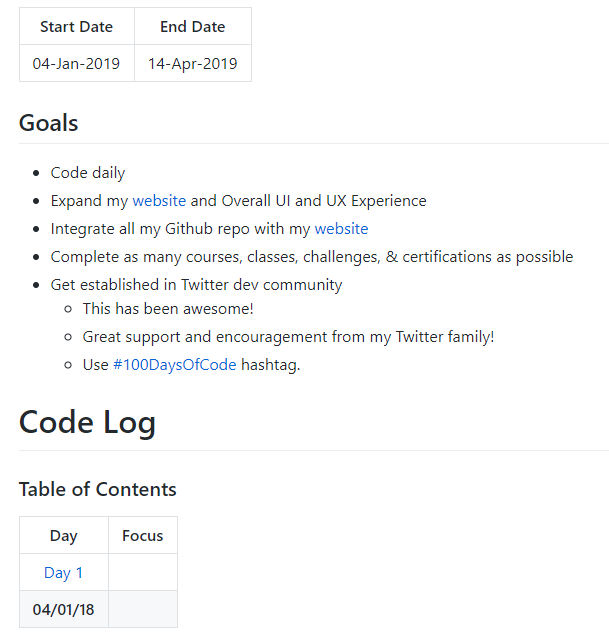
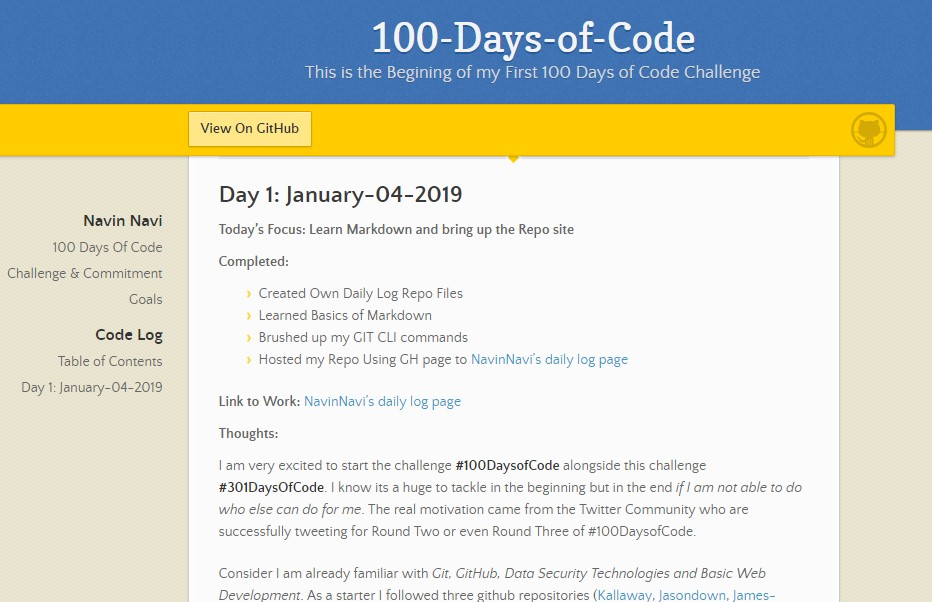

# Navin Navi

## 100 Days Of Code

| Log |
| --- |
| [this log](README.md) |

## Challenge & Commitment
This is part of Alexander Kallaway's [100DaysOfCode](https://github.com/Kallaway/100-days-of-code "the official repo") challenge. More details about the challenge can be found here: [100daysofcode.com](http://100daysofcode.com/ "100daysofcode.com").

**Commitment:** *I will code daily for the next 100 days.*

|  Start Date   | End Date     |
| ------------- | ------------ |
|  04-Jan-2019  |  14-Apr-2019 |

## Goals

- Code daily
- Expand my [website](https://vanuss.in/) and Overall UI and UX Experience
- Integrate all my Github repo with my [website](https://vanuss.in/)
- Complete as many courses, classes, challenges, & certifications as possible
- Get established in Twitter dev community
  - This has been awesome!
  - Great support and encouragement from my Twitter family!
  - Use [#100DaysOfCode](https://twitter.com/search?q=%23100DaysOfCode&src=tyah) hashtag.

# Code Log

### Table of Contents 

| Day | Focus |
|:---:|:-----:|
|[Day 1](#day-1) **04/01/18**| Learn Markdown and bring up the Repo site |

<!-- ---

## Day 1: January-04-2019

#### Today's Focus:

#### Completed:

#### Link to Work:

#### Thoughts: -->

---

## Day 1: January-04-2019

#### Today's Focus: "Learn Markdown and bring up the Repo site"

#### Completed: 
+ Created Own Daily Log Repo Files
+ Learned Basics of Markdown
+ Brushed up my GIT CLI commands
+ Hosted my Repo Using GH page to [NavinNavi's daily log page](https://navinnavi19.github.io/100-Days-of-Code/)

#### Link to Work: [NavinNavi's daily log page](https://navinnavi19.github.io/100-Days-of-Code/)

#### Thoughts:

I am very excited to start the challenge [**#100DaysofCode**](https://twitter.com/search?q=%23100DaysOfCode) alongside this challenge [**#301DaysOfCode**](https://twitter.com/search?q=%23301DaysOfCode&src=tyah). I know its a huge to tackle in the beginning but in the end *if I am not able to do who else can do for me*. The real motivation came from the Twitter Community who are successfully tweeting for Round Two or even Round Three of #100DaysofCode.

Consider I am already familiar with *Git, GitHub, Data Security Technologies and Basic Web Development*. As a starter I followed three github  repositories ([Kallaway](https://github.com/kallaway/100-days-of-code), [Jasondown](https://github.com/jasondown/100-days-of-code), [James-Priest](https://github.com/james-priest/100-days-of-code-log)) to created my own [**Daily Log Repo**](https://github.com/NavinNavi19/100-Days-of-Code). I did not directly fork the repo because I decided to learn the markdown language on my own. A quick **brushup of markdown** is covered in this [**Cheatsheet**](https://github.com/adam-p/markdown-here/wiki/Markdown-Cheatsheet).

I imported some of my old local git files using CLI to GitHub faced some small problems but this [**link**](https://help.github.com/articles/adding-an-existing-project-to-github-using-the-command-line/)
helped me to brush up *git CLI remote pull/push commands*.

After some testing with my [**Template Repo**](https://navinnavi19.github.io/Collection-of-Templates/) using this [**post**](https://nicolas-van.github.io/easy-markdown-to-github-pages/) as a reference. Finally, I learned to quickly host my [**Site**](https://navinnavi19.github.io/100-Days-of-Code/) UP with github pages using Jekyll Theme by [Mattgraham](https://twitter.com/mattgraham).

**Day 1 Overview of Images**

[Table of Contents](#toc)
